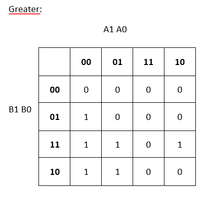

# Digital-electronics-1
## Lab 2
### 1)
| **Dec. equivalent** | **B[1:0]** | **A[1:0]** | **B is greater than A** | **B equals A** | **B is less than A** |
| :-: | :-: | :-: | :-: | :-: | :-: |
| 0 | 0 0 | 0 0 | 0 | 1 | 0 |
| 1 | 0 0 | 0 1 | 0 | 0 | 1 |
| 2 | 0 0 | 1 0 | 0 | 0 | 1 |
| 3 | 0 0 | 1 1 | 0 | 0 | 1 |
| 4 | 0 1 | 0 0 | 1 | 0 | 0 |
| 5 | 0 1 | 0 1 | 0 | 1 | 0 |
| 6 | 0 1 | 1 0 | 0 | 0 | 1 |
| 7 | 0 1 | 1 1 | 0 | 0 | 1 |
| 8 | 1 0 | 0 0 | 1 | 0 | 0 |
| 9 | 1 0 | 0 1 | 1 | 0 | 0 |
| 10 | 1 0 | 1 0 | 0 | 1 | 0 |
| 11 | 1 0 | 1 1 | 0 | 0 | 1 |
| 12 | 1 1 | 0 0 | 1 | 0 | 0 |
| 13 | 1 1 | 0 1 | 1 | 0 | 0 |
| 14 | 1 1 | 1 0 | 1 | 0 | 0 |
| 15 | 1 1 | 1 1 | 0 | 1 | 0 |


### 2) Dvojbitový komparátor



Link na EDA playground: https://www.edaplayground.com/x/Jr9j

### 3) Štvorbitový komparátor
**Súbor design.vhd**
```vhdl
architecture dataflow of gates is
begin
    f_o     <= (not b_i and a_i) or (not c_i and not b_i);
   	fnand_o <= not (not (not b_i and a_i) and not(not b_i and not c_i));
  	fnor_o  <= not (b_i or not a_i) or not (c_i or b_i);
  
end architecture dataflow;
```
**Súbor testbench.vhd**
```vhdl
architecture dataflow of gates is
begin
    f_o     <= (not b_i and a_i) or (not c_i and not b_i);
   	fnand_o <= not (not (not b_i and a_i) and not(not b_i and not c_i));
  	fnor_o  <= not (b_i or not a_i) or not (c_i or b_i);
  
end architecture dataflow;
```
**Výpis z konzole**
```vhdl
architecture dataflow of gates is
begin
    f_o     <= (not b_i and a_i) or (not c_i and not b_i);
   	fnand_o <= not (not (not b_i and a_i) and not(not b_i and not c_i));
  	fnor_o  <= not (b_i or not a_i) or not (c_i or b_i);
  
end architecture dataflow;
```

Link na EDA playground:

