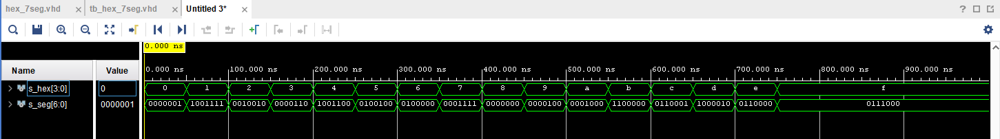
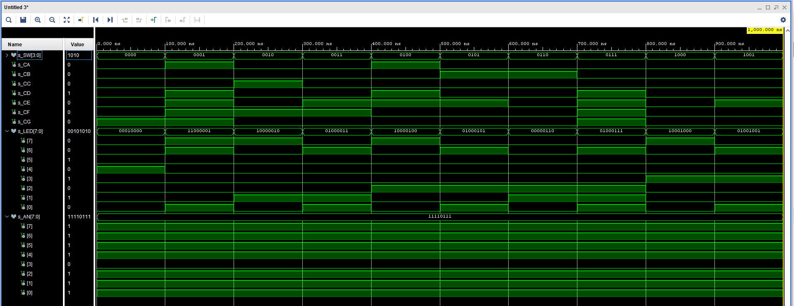

# Digital-electronics-1
## Lab 4
### 1) Preparation tasks
| Hex | Inputs | A | B | C | D | E | F | G |
| :-: | :-: | :-: | :-: | :-: | :-: | :-: | :-: | :-: |
| 0 | 0000 | 0 | 0 | 0 | 0 | 0 | 0 | 1 |
| 1 | 0001 | 1 | 0 | 0 | 1 | 1 | 1 | 1 |
| 2 | 0010 | 0 | 0 | 1 | 0 | 0 | 1 | 0 |
| 3 | 0011 | 0 | 0 | 0 | 0 | 1 | 1 | 0 |
| 4 | 0100 | 1 | 0 | 0 | 1 | 1 | 0 | 0 |
| 5 | 0101 | 0 | 1 | 0 | 0 | 1 | 0 | 0 |
| 6 | 0110 | 0 | 1 | 0 | 0 | 0 | 0 | 0 |
| 7 | 0111 | 0 | 0 | 0 | 1 | 1 | 1 | 1 |
| 8 | 1000 | 0 | 0 | 0 | 0 | 0 | 0 | 0 |
| 9 | 1001 | 0 | 0 | 0 | 0 | 1 | 0 | 0 |
| A | 1010 | 0 | 0 | 0 | 1 | 0 | 0 | 0 |
| b | 1011 | 1 | 1 | 0 | 0 | 0 | 0 | 0 |
| C | 1100 | 0 | 1 | 1 | 0 | 0 | 0 | 1 |
| d | 1101 | 1 | 0 | 0 | 0 | 0 | 1 | 0 |
| E | 1110 | 0 | 1 | 1 | 0 | 0 | 0 | 0 |
| F | 1111 | 0 | 1 | 1 | 1 | 0 | 0 | 0 |

| Cathode/Anode name | Connection |
| :-: | :-: |
| AN0 | J17 |
| AN1 | J18 |
| AN2 | T9 |
| AN3 | J14 |
| AN4 | P14 |
| AN5 | T14 |
| AN6 | K2 |
| AN7 | U13 |
| CA | T10 | 
| CB | R10 | 
| CC | K16 | 
| CD | K13 | 
| CE | P15 | 
| CF | T11 | 
| CG | L18 | 
| DP | H15 |

### 2) Seven-segment display decoder
**VHDL architecture from source file hex_7seg.vhd**
```vhdl
architecture Behavioral of hex_7seg is

begin
    --------------------------------------------------------------------
    -- p_7seg_decoder:
    -- A combinational process for 7-segment display (Common Anode)
    -- decoder. Any time "hex_i" is changed, the process is "executed".
    -- Output pin seg_o(6) controls segment A, seg_o(5) segment B, etc.
    --       segment A
    --        | segment B
    --        |  | segment C
    --        |  |  |   ...   segment G
    --        +-+|+-+          |
    --          |||            |
    -- seg_o = "0000001"-------+
    --------------------------------------------------------------------
    p_7seg_decoder : process(hex_i)
    begin
        case hex_i is
            when "0000" =>
                seg_o <= "0000001";     -- 0
                
            when "0001" =>
                seg_o <= "1001111";     -- 1
                
            when "0010" =>
                seg_o <= "0010010";     -- 2
                
            when "0011" =>
                seg_o <= "0000110";     -- 3
                
            when "0100" =>
                seg_o <= "1001100";     -- 4
                
            when "0101" =>
                seg_o <= "0100100";     -- 5                
                
            when "0110" =>
                seg_o <= "0100000";     -- 6
                
            when "0111" =>
                seg_o <= "0001111";     -- 7  

            when "1000" =>
                seg_o <= "0000000";     -- 8
                
            when "1001" =>
                seg_o <= "0000100";     -- 9  

            when "1010" =>
                seg_o <= "0001000";     -- A
                
            when "1011" =>
                seg_o <= "1100000";     -- b  

            when "1100" =>
                seg_o <= "0110001";     -- C

            when "1101" =>
                seg_o <= "1000010";     -- d

            when "1110" =>
                seg_o <= "0110000";     -- E
                
            when others =>
                seg_o <= "0111000";     -- F
        end case;
    end process p_7seg_decoder;
    
end architecture Behavioral;
```
**VHDL stimulus process from testbench file tb_hex_7seg.vhd**
```vhdl
architecture Behavioral of tb_hex_7seg is

    -- Local signals
    signal s_hex       : std_logic_vector(4 - 1 downto 0);
    signal s_seg       : std_logic_vector(7 - 1 downto 0);

begin

    -- Connecting testbench signals with hex_7seg entity (Unit Under Test)
    uut_hex_7seg : entity work.hex_7seg
        port map(
            hex_i           => s_hex,
            seg_o           => s_seg
        );
p_stimulus : process
    begin
        -- Report a note at the begining of stimulus process
        report "Stimulus process started" severity note;
        
        s_hex <= "0000"; wait for 50 ns; --0
        
        s_hex <= "0001"; wait for 50 ns; --1
        
        s_hex <= "0010"; wait for 50 ns; --2
        
        s_hex <= "0011"; wait for 50 ns; --3
        
        s_hex <= "0100"; wait for 50 ns; --4
        
        s_hex <= "0101"; wait for 50 ns; --5
        
        s_hex <= "0110"; wait for 50 ns; --6
        
        s_hex <= "0111"; wait for 50 ns; --7
        
        s_hex <= "1000"; wait for 50 ns; --8
        
        s_hex <= "1001"; wait for 50 ns; --9
        
        s_hex <= "1010"; wait for 50 ns; --A
        
        s_hex <= "1011"; wait for 50 ns; --b
        
        s_hex <= "1100"; wait for 50 ns; --C
        
        s_hex <= "1101"; wait for 50 ns; --d
        
        s_hex <= "1110"; wait for 50 ns; --E    
  
        s_hex <= "1111"; wait for 50 ns; --F
  
        -- Report a note at the end of stimulus process
        report "Stimulus process finished" severity note;
        wait;
    end process p_stimulus;

end Behavioral;
```

**Screenshot with simulated time waveforms**


**VHDL code from source file top.vhd**
```vhdl
 -- Instance (copy) of hex_7seg entity
    hex2seg : entity work.hex_7seg
        port map(
            hex_i            => SW,
            
            seg_o(6)         => CA,
            seg_o(5)         => CB,
            seg_o(4)         => CC,
            seg_o(3)         => CD,
            seg_o(2)         => CE,
            seg_o(1)         => CF,
            seg_o(0)         => CG
        );
```
### 3) LED(7:4) indicators

| **Hex** | **Inputs** | **LED4** | **LED5** | **LED6** | **LED7** |
| :-: | :-: | :-: | :-: | :-: | :-: |
| 0 | 0000 |  |  |  |  |
| 1 | 0001 |  |  |  |  |
| 2 | 0010 |  |  |  |  |
| 3 | 0011 |  |  |  |  |
| 4 | 0100 |  |  |  |  |
| 5 | 0101 |  |  |  |  |
| 6 | 0110 |  |  |  |  |
| 7 | 0111 |  |  |  |  |
| 8 | 1000 |  |  |  |  |
| 9 | 1001 |  |  |  |  |
| A | 1010 |  |  |  |  |
| b | 1011 |  |  |  |  |
| C | 1100 |  |  |  |  |
| d | 1101 |  |  |  |  |
| E | 1110 |  |  |  |  |
| F | 1111 |  |  |  |  |


**VHDL code for LEDs(7:4)**
```vhdl
 -- Display input value on LEDs
    LED(3 downto 0) <= SW;
    
    -- LED(7:4) indicators
    -- Turn LED(4) on if input value is equal to 0, ie "0000"
    LED(4)  <= '1' when (SW = "0000") else '0';
     
    -- Turn LED(5) on if input value is greater than "1001", ie 9
    LED(5)  <= '1' when (SW > "1001") else '0';
    
    -- Turn LED(6) on if input value is odd, ie 1, 3, 5, ...
    LED(6) <= '1' when (SW = "0001" or SW = "0011" or SW = "0101" or SW = "0111" or SW = "1001" or SW = "1011" or SW = "1101" or SW = "1111") else '0';
    
    -- Turn LED(7) on if input value is a power of two, ie 1, 2, 4, or 8
    LED(7)  <= '1' when (SW = "0001" or SW = "0010" or SW = "0100" or SW = "1000") else '0';
```

**Screenshot with simulated time waveforms**


