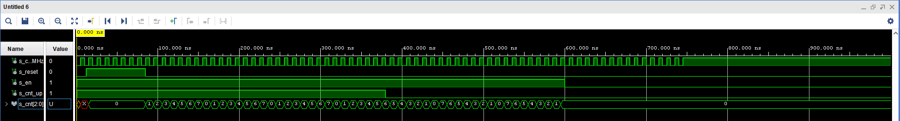

# Digital-electronics-1
## Lab 4
### 1) Preparation tasks
   | **Time interval** | **Number of clk periods** | **Number of clk periods in hex** | **Number of clk periods in binary** |
   | :-: | :-: | :-: | :-: |
   | 2&nbsp;ms | 200 000 | `x"3_0d40"` | `b"0011_0000_1101_0100_0000"` |
   | 4&nbsp;ms | 400 000 | `x"6_1a80"` | `b"0110_0001_1010_1000_0000"` |
   | 10&nbsp;ms | 1 000 000 | `x"f_4240"` | `b"1111_0100_0010_0100_0000"` |
   | 250&nbsp;ms | 25 000 000 | `x"17d_7840"` | `b"0001_0111_1101_0111_1000_0100_0000"` |
   | 500&nbsp;ms | 50 000 000 | `x"2f2_f080"` | `b"0010_1111_1010_1111_0000_1000_0000"` |
   | 1&nbsp;sec | 100 000 000 | `x"5F5_E100"` | `b"0101_1111_0101_1110_0001_0000_0000"` |
   
   | **Button name** | **Connection** | **Logic/voltage value while pressed** | **Logic/voltage value while not pressed** |
   | :-: | :-: | :-: | :-: |
   | BTNL | P17 | 1/3.3V | 0/0V |
   | BTNR | M17 | 1/3.3V | 0/0V |
   | BTNU | M18 | 1/3.3V | 0/0V |
   | BTND | P18 | 1/3.3V | 0/0V |
   | BTNC | N17 | 1/3.3V | 0/0V |
   
### 2) Bidirectional counter
**VHDL code of the process p_cnt_up_down**
```vhdl
 p_cnt_up_down : process(clk)
    begin
        if rising_edge(clk) then
        
            if (reset = '1') then               -- Synchronous reset
                s_cnt_local <= (others => '0'); -- Clear all bits

            elsif (en_i = '1') then       -- Test if counter is enabled


                -- TEST COUNTER DIRECTION HERE

                if (cnt_up_i = '1') then
                    s_cnt_local <= s_cnt_local + 1;
                else
                    s_cnt_local <= s_cnt_local - 1;

                end if;
            end if;
       end if;
    end process p_cnt_up_down;
```
**VHDL reset and stimulus processes from testbench file tb_cnt_up_down.vhd**
```vhdl
begin
    -- Connecting testbench signals with cnt_up_down entity
    -- (Unit Under Test)
    uut_cnt : entity work.cnt_up_down
        generic map(
            g_CNT_WIDTH  => c_CNT_WIDTH
        )
        port map(
            clk      => s_clk_100MHz,
            reset    => s_reset,
            en_i     => s_en,
            cnt_up_i => s_cnt_up,
            cnt_o    => s_cnt
        );

    --------------------------------------------------------------------
    -- Clock generation process
    --------------------------------------------------------------------
    p_clk_gen : process
    begin
        while now < 750 ns loop         -- 75 periods of 100MHz clock
            s_clk_100MHz <= '0';
            wait for c_CLK_100MHZ_PERIOD / 2;
            s_clk_100MHz <= '1';
            wait for c_CLK_100MHZ_PERIOD / 2;
        end loop;
        wait;
    end process p_clk_gen;

    --------------------------------------------------------------------
    -- Reset generation process
    --------------------------------------------------------------------
    p_reset_gen : process
    begin
        s_reset <= '0';
        wait for 12 ns;
        
        -- Reset activated
        s_reset <= '1';
        wait for 73 ns;

        s_reset <= '0';
        wait;
    end process p_reset_gen;

    --------------------------------------------------------------------
    -- Data generation process
    --------------------------------------------------------------------
    p_stimulus : process
    begin
        report "Stimulus process started" severity note;

        -- Enable counting
        s_en     <= '1';
        
        -- Change counter direction
        s_cnt_up <= '1';
        wait for 380 ns;
        s_cnt_up <= '0';
        wait for 220 ns;

        -- Disable counting
        s_en     <= '0';

        report "Stimulus process finished" severity note;
        wait;
    end process p_stimulus;

end architecture testbench;
```
**Screenshot with simulated time waveforms**


### 3) Top level
**VHDL code from source file top.vhd with all instantiations for the 4-bit bidirectional counter**
```vhdl

```
**Image of the top layer including both counters**

