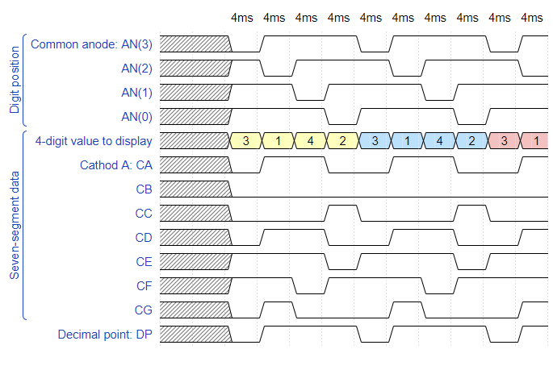
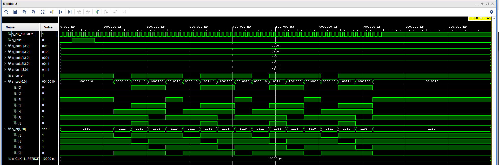
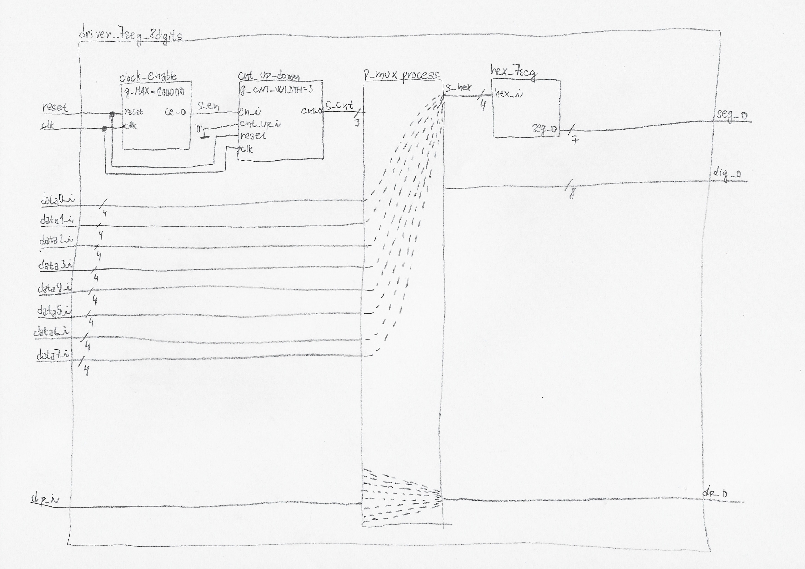

# Digital-electronics-1
## Lab 5
### 1) Preparation tasks
**Timing diagram figure for displaying value 3.142**


### 2) Display driver
**VHDL code of the process p_mux**
```vhdl

```

**VHDL testbench file tb_driver_7seg_4digits**
```vhdl

```

**Screenshot with simulated time waveforms**


**VHDL architecture of the top layer**
```vhdl

```

### 3)Eight-digit driver
**Screenshot with simulated time waveforms**

