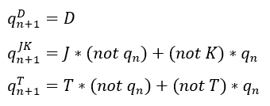

# Digital-electronics-1
## Lab 6
### 1) Preparation tasks
**Characteristic equations and completed tables for D, JK, T flip-flops**

 | **clk** | **d** | **q(n)** | **q(n+1)** | **Comments** |
   | :-: | :-: | :-: | :-: | :-- |
   |  | 0 | 0 |  |  |
   |  | 0 | 1 |  |  |
   |  | 1 |  |  |  |
   |  | 1 |  |  |  |

   | **clk** | **j** | **k** | **q(n)** | **q(n+1)** | **Comments** |
   | :-: | :-: | :-: | :-: | :-: | :-- |
   |  | 0 | 0 | 0 | 0 | No change |
   |  | 0 | 0 | 1 | 1 | No change |
   |  | 0 |  |  |  |  |
   |  | 0 |  |  |  |  |
   |  | 1 |  |  |  |  |
   |  | 1 |  |  |  |  |
   |  | 1 |  |  |  |  |
   |  | 1 |  |  |  |  |

   | **clk** | **t** | **q(n)** | **q(n+1)** | **Comments** |
   | :-: | :-: | :-: | :-: | :-- |
   |  | 0 | 0 |  |  |
   |  | 0 | 1 |  |  |
   |  | 1 |  |  |  |
   |  | 1 |  |  |  |
