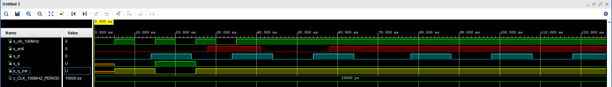
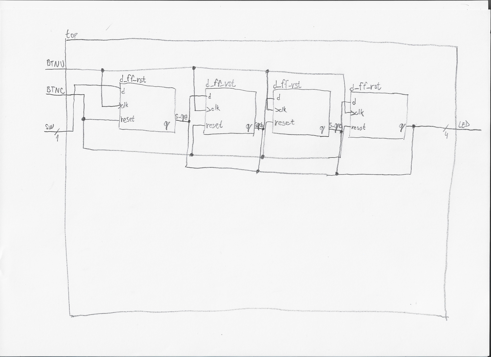

# Digital-electronics-1
## Lab 6
### 1) Preparation tasks
**Characteristic equations and completed tables for D, JK, T flip-flops**


 | **clk** | **d** | **q(n)** | **q(n+1)** | **Comments** |
   | :-: | :-: | :-: | :-: | :-- |
   | ↑ | 0 | 0 |  |  |
   | ↑ | 0 | 1 |  |  |
   | ↑ | 1 |  |  |  |
   | ↑ | 1 |  |  |  |

   | **clk** | **j** | **k** | **q(n)** | **q(n+1)** | **Comments** |
   | :-: | :-: | :-: | :-: | :-: | :-- |
   | ↑ | 0 | 0 | 0 | 0 | No change |
   | ↑ | 0 | 0 | 1 | 1 | No change |
   | ↑ | 0 |  |  |  |  |
   | ↑ | 0 |  |  |  |  |
   | ↑ | 1 |  |  |  |  |
   | ↑ | 1 |  |  |  |  |
   | ↑ | 1 |  |  |  |  |
   | ↑ | 1 |  |  |  |  |

   | **clk** | **t** | **q(n)** | **q(n+1)** | **Comments** |
   | :-: | :-: | :-: | :-: | :-- |
   | ↑ | 0 | 0 |  |  |
   | ↑ | 0 | 1 |  |  |
   | ↑ | 1 |  |  |  |
   | ↑ | 1 |  |  |  |

### 2) D latch
**VHDL code listing of the process p_d_latch**
```vhdl

```

**Listing of VHDL reset and stimulus processes from the testbench tb_d_latch.vhd file**
```vhdl

```

**Screenshot with simulated time waveforms**


### 3) Flip-flops
**VHDL code listing of the processes p_d_ff_arst, p_d_ff_rst, p_jk_ff_rst, p_t_ff_rst**
```vhdl

```

**Listing of VHDL clock, reset and stimulus processes from the testbench files**
```vhdl

```

**Screenshot with simulated time waveforms**


### 4) Shift register



