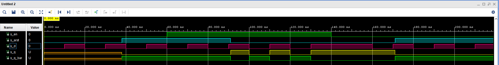

# Digital-electronics-1
## Lab 7
### 1) Preparation tasks
**Characteristic equations and completed tables for D, JK, T flip-flops**


 | **clk** | **d** | **q(n)** | **q(n+1)** | **Comments** |
   | :-: | :-: | :-: | :-: | :-- |
   | ↑ | 0 | 0 | 0 | No change |
   | ↑ | 0 | 1 | 0 | Invert |
   | ↑ | 1 | 0 | 1 | Invert |
   | ↑ | 1 | 1 | 1 | No change |

   | **clk** | **j** | **k** | **q(n)** | **q(n+1)** | **Comments** |
   | :-: | :-: | :-: | :-: | :-: | :-- |
   | ↑ | 0 | 0 | 0 | 0 | No change |
   | ↑ | 0 | 0 | 1 | 1 | No change |
   | ↑ | 0 | 1 | 0 | 0 | Reset |
   | ↑ | 0 | 1 | 1 | 0 | Reset |
   | ↑ | 1 | 0 | 0 | 1 | Set |
   | ↑ | 1 | 0 | 1 | 1 | Set |
   | ↑ | 1 | 1 | 0 | 1 | Toggle |
   | ↑ | 1 | 1 | 1 | 0 | Toggle |

   | **clk** | **t** | **q(n)** | **q(n+1)** | **Comments** |
   | :-: | :-: | :-: | :-: | :-- |
   | ↑ | 0 | 0 | 0 | No change |
   | ↑ | 0 | 1 | 1 | No change |
   | ↑ | 1 | 0 | 1 | Invert (Toggle) |
   | ↑ | 1 | 1 | 0 | Invert (Toggle) |

### 2) D latch
**VHDL code listing of the process p_d_latch**
```vhdl
  ------------------------------------------------------------------------
    -- p_alarm:
    -- A combinational process of alarm clock.
    ------------------------------------------------------------------------
    p_d_latch : process (d, arst, en)
    begin
        if (arst = '1') then
           q       <= '0';
           q_bar   <= '1';
           
        elsif (en = '1') then
           q       <= d;
           q_bar   <= not d;
        end if;
    end process p_d_latch;
```

**Listing of VHDL reset and stimulus processes from the testbench tb_d_latch.vhd file**
```vhdl
 --------------------------------------------------------------------
    -- Reset generation process
    --------------------------------------------------------------------
     p_reset_gen : process
     begin
         s_arst <= '0';
         wait for 38 ns;
         
         -- Reset activated
         s_arst <= '1';
         wait for 53 ns;
    
         --Reset deactivated
         s_arst <= '0';
        
         wait for 80 ns;
         s_arst <= '1';
    
         wait;
     end process p_reset_gen;
    
    --------------------------------------------------------------------
    -- Data generation process
    --------------------------------------------------------------------
    p_stimulus : process
    begin
        report "Stimulus process started" severity note;
        
        s_d  <= '0';
        s_en <= '0';
        wait for 10 ns;
        
        --remember/hold values (no value to hold)
        s_d  <= '1';
        wait for 10 ns;
        s_d  <= '0';
        wait for 10 ns;
        s_d  <= '1';
        --reset set to 1 -> all values '0' except q_bar
        wait for 10 ns;
        s_d  <= '0';
        wait for 10 ns;
        s_d  <= '1';
        wait for 10 ns;
    
        --Reseting output q
        s_d  <= '0';
        s_en <= '1';
        assert ((s_arst = '0') and (s_en = '1'))
        report "s_en setted to one -> Reseting output q" severity note;	
        wait for 10 ns;
        
        --Seting output q - en is setted to 1
        s_d  <= '1';
        assert ((s_arst = '0') and (s_en = '1'))
        report "s_en setted to one -> Seting output q" severity note;	
        wait for 10 ns;
        
        
        s_d  <= '0';
        wait for 10 ns;   
        s_d  <= '1';
        wait for 10 ns;
        s_d  <= '0';
        wait for 10 ns;
        s_d  <= '1';
        --reset set to 0 - again operating 
        wait for 10 ns;
        s_d  <= '0';
        wait for 10 ns;
        s_d  <= '1';
        wait for 10 ns;
    
    
        -- Remember/hold values 
        s_en <= '0';
        assert ((s_arst = '0') and (s_en = '0'))
        report "s_en setted to zero -> remember/hold value" severity note;
        wait for 10 ns;
        
        s_d  <= '1';
        wait for 10 ns;
        s_d  <= '0';
        wait for 10 ns;
        s_d  <= '1';
        wait for 10 ns;
        s_d  <= '0';
        wait for 10 ns;
        s_d  <= '1';
        --reset set to 1 - all values should be '0'
        wait for 10 ns;
        s_d  <= '0';
        wait for 10 ns;
        s_d  <= '1';
        wait for 10 ns;
        s_d  <= '0';
        
        report "Stimulus process finished" severity note;
        wait;
    end process p_stimulus;
```

**Screenshot with simulated time waveforms**


### 3) Flip-flops
**VHDL code listing of the process p_d_ff_arst**
```vhdl
 p_d_ff_arst : process (clk, arst)                    
   begin                                             
       if (arst = '1') then                          
           q     <= '0';                                 
           q_bar <= '1';                             
       elsif rising_edge(clk) then                        
           q     <= d;                                   
           q_bar <= not d;                            
       end if;                                       
  end process p_d_ff_arst;
```
**VHDL code listing of the process p_d_ff_rst**
```vhdl

```
**VHDL code listing of the process p_jk_ff_rst**
```vhdl

```
**VHDL code listing of the process p_t_ff_rst**
```vhdl

```

**Listing of VHDL clock, reset and stimulus processes from the testbench of d_ff_arst**
```vhdl

```
**Listing of VHDL clock, reset and stimulus processes from the testbench of d_ff_rst**
```vhdl

```
**Listing of VHDL clock, reset and stimulus processes from the testbench of jk_ff_rst**
```vhdl

```
**Listing of VHDL clock, reset and stimulus processes from the testbench of t_ff_rst**
```vhdl

```
**Screenshot with simulated time waveforms of d_ff_arst**

**Screenshot with simulated time waveforms of d_ff_rst**

**Screenshot with simulated time waveforms of jk_ff_rst**

**Screenshot with simulated time waveforms of t_ff_rst**


### 4) Shift register


