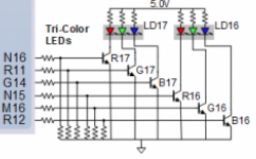

# Digital-electronics-1
## Lab 8
### 1) Preparation tasks
**State table**
| **Input P** | `0` | `0` | `1` | `1` | `0` | `1` | `0` | `1` | `1` | `1` | `1` | `0` | `0` | `1` | `1` | `1` |
| :-- | :-: | :-: | :-: | :-: | :-: | :-: | :-: | :-: | :-: | :-: | :-: | :-: | :-: | :-: | :-: | :-: |
| **Clock** | ↑ | ↑ | ↑ | ↑ | ↑ | ↑ | ↑ | ↑ | ↑ | ↑ | ↑ | ↑ | ↑ | ↑ | ↑ | ↑ |
| **State** | A | A | B | C | C | D | A | B | C | D | B | B | B | C | D | B |
| **Output R** | `0` | `0` | `0` | `0` | `0` | `1` | `0` | `0` | `0` | `1` | `0` | `0` | `0` | `0` | `1` | `0` |

**Table with color settings**
| **RGB LED** | **Artix-7 pin names** | **Red** | **Yellow** | **Green** |
| :-: | :-: | :-: | :-: | :-: |
| LD16 | N15, M16, R12 | `1,0,0` | `1,1,0` | `0,1,0` |
| LD17 | N16, R11, G14 | `1,0,0` | `1,1,0` | `0,1,0` |



### 2) Traffic light controller
**State diagram**


**Listing of VHDL code of sequential process p_traffic_fsm**
```vhdl
p_traffic_fsm : process(clk)
    begin
        if rising_edge(clk) then
            if (reset = '1') then       -- Synchronous reset
                s_state <= STOP1 ;      -- Set initial state
                s_cnt   <= c_ZERO;      -- Clear all bits

            elsif (s_en = '1') then
                -- Every 250 ms, CASE checks the value of the s_state 
                -- variable and changes to the next state according 
                -- to the delay value.
                case s_state is

                    -- If the current state is STOP1, then wait 1 sec
                    -- and move to the next GO_WAIT state.
                    when STOP1 =>
                        -- Count up to c_DELAY_1SEC
                        if (s_cnt < c_DELAY_1SEC) then
                            s_cnt <= s_cnt + 1;
                        else
                            -- Move to the next state
                            s_state <= WEST_GO;
                            -- Reset local counter value
                            s_cnt   <= c_ZERO;
                        end if;

                    when WEST_GO =>
                        if (s_cnt < c_DELAY_4SEC) then
                            s_cnt <= s_cnt + 1;
                        else
                            -- Move to the next state
                            s_state <= WEST_WAIT;
                            -- Reset local counter value
                            s_cnt   <= c_ZERO;
                        end if;
                   
                    when WEST_WAIT =>
                        if (s_cnt < c_DELAY_2SEC) then
                            s_cnt <= s_cnt + 1;
                        else
                            -- Move to the next state
                            s_state <= STOP2;
                            -- Reset local counter value
                            s_cnt   <= c_ZERO;
                        end if;
                    
                    when STOP2 =>
                        -- Count up to c_DELAY_1SEC
                        if (s_cnt < c_DELAY_1SEC) then
                            s_cnt <= s_cnt + 1;
                        else
                            -- Move to the next state
                            s_state <= SOUTH_GO;
                            -- Reset local counter value
                            s_cnt   <= c_ZERO;
                        end if;

                    when SOUTH_GO =>
                        if (s_cnt < c_DELAY_4SEC) then
                            s_cnt <= s_cnt + 1;
                        else
                            -- Move to the next state
                            s_state <= SOUTH_WAIT;
                            -- Reset local counter value
                            s_cnt   <= c_ZERO;
                        end if;
                   
                    when SOUTH_WAIT =>
                        if (s_cnt < c_DELAY_2SEC) then
                            s_cnt <= s_cnt + 1;
                        else
                            -- Move to the next state
                            s_state <= STOP1;
                            -- Reset local counter value
                            s_cnt   <= c_ZERO;
                        end if;
                    
                    -- It is a good programming practice to use the 
                    -- OTHERS clause, even if all CASE choices have 
                    -- been made. 
                    when others =>
                        s_state <= STOP1;

                end case;
            end if; -- Synchronous reset
        end if; -- Rising edge
    end process p_traffic_fsm;
```
**Listing of VHDL code of combinatorial process p_output_fsm**
```vhdl
p_output_fsm : process(s_state)
    begin
        case s_state is
            when STOP1 =>
                south_o <= "100";   -- Red (RGB = 100)
                west_o  <= "100";   -- Red (RGB = 100)
            
            when WEST_GO =>
                south_o <= "100";   -- Red (RGB = 100)
                west_o  <= "010";   -- Green (RGB = 010)
           
            when WEST_WAIT =>
                south_o <= "100";   -- Red (RGB = 100)
                west_o  <= "110";   -- Yellow (RGB = 110)
            
            when STOP2 =>
                south_o <= "100";   -- Red (RGB = 100)
                west_o  <= "100";   -- Red (RGB = 100)
            
            when SOUTH_GO =>
                south_o <= "010";   -- Green (RGB = 010)
                west_o  <= "100";   -- Red (RGB = 100)
            
            when SOUTH_WAIT =>
                south_o <= "110";   -- Yellow (RGB = 110)
                west_o  <= "100";   -- Red (RGB = 100)

            when others =>
                south_o <= "100";   -- Red (RGB = 100)
                west_o  <= "100";   -- Red (RGB = 100)
        end case;
    end process p_output_fsm;
```
**Screenshot(s) of the simulation, from which it is clear that controller works correctly**


### 3) Smart controller
**State table**

| **Current state** | **Direction South** | **Direction West** | **Delay** | **None car** | **West car** | **South car** | **Both cars** |
| :-: | :-: | :-: | :-: | :-: | :-: | :-: | :-: |
| GO_SOUTH | green | red | 3 sec | GO_SOUTH | WAIT_SOUTH | GO_SOUTH | WAIT_SOUTH |
| WAIT_SOUTH | yellow | red | 1 sec | GO_WEST | GO_WEST | GO_WEST | GO_WEST |
| GO_WEST | red | green | 3 sec | GO_WEST | GO_WEST | WAIT_WEST | WAIT_WEST |
| WAIT_WEST | red | yellow | 1 sec | GO_SOUTH | GO_SOUTH | GO_SOUTH | GO_SOUTH |

**State diagram**


**Listing of VHDL code of sequential process p_smart_traffic_fsm**
```vhdl
    p_smart_traffic_fsm : process(clk)
    begin
        if rising_edge(clk) then
            if (reset = '1') then       -- Synchronous reset
                s_state <= GO_SOUTH ;   -- Set initial state
                s_cnt   <= c_ZERO;      -- Clear all bits
    
            elsif (s_en = '1') then
                -- Every 250 ms, CASE checks the value of the s_state 
                -- variable and changes to the next state according 
                -- to the delay value.
                case s_state is
    
                    when GO_SOUTH =>
                        if (s_cnt < c_DELAY_4SEC) then
                            s_cnt <= s_cnt + 1;
                        elsif (west_i = '1') then
                            -- Move to the next state
                            s_state <= WAIT_SOUTH;
                            -- Reset local counter value
                            s_cnt   <= c_ZERO;
                        end if;
    
                    when WAIT_SOUTH =>
                        -- WRITE YOUR CODE HERE
                        if (s_cnt < c_DELAY_1SEC) then
                            s_cnt <= s_cnt + 1;
                        else
                            -- Move to the next state
                            s_state <= GO_WEST;
                            -- Reset local counter value
                            s_cnt   <= c_ZERO;
                        end if;
                    
                    when GO_WEST =>
                        if (s_cnt < c_DELAY_4SEC) then
                            s_cnt <= s_cnt + 1;
                        elsif (south_i = '1') then
                            -- Move to the next state
                            s_state <= WAIT_WEST;
                            -- Reset local counter value
                            s_cnt   <= c_ZERO;
                        end if;
                        
                    when WAIT_WEST =>
                        -- WRITE YOUR CODE HERE
                        if (s_cnt < c_DELAY_1SEC) then
                            s_cnt <= s_cnt + 1;
                        else
                            -- Move to the next state
                            s_state <= GO_SOUTH;
                            -- Reset local counter value
                            s_cnt   <= c_ZERO;
                        end if;
                        
                    -- It is a good programming practice to use the 
                    -- OTHERS clause, even if all CASE choices have 
                    -- been made. 
                    when others =>
                        s_state <= GO_SOUTH;
    
                end case;
            end if; -- Synchronous reset
        end if; -- Rising edge
    end process p_smart_traffic_fsm;
```
