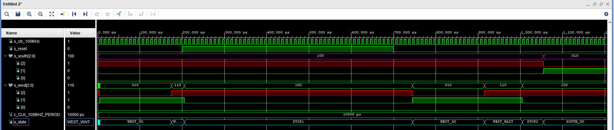

# Digital-electronics-1
## Lab 8
### 1) Preparation tasks
**State table**
| **Input P** | `0` | `0` | `1` | `1` | `0` | `1` | `0` | `1` | `1` | `1` | `1` | `0` | `0` | `1` | `1` | `1` |
| :-- | :-: | :-: | :-: | :-: | :-: | :-: | :-: | :-: | :-: | :-: | :-: | :-: | :-: | :-: | :-: | :-: |
| **Clock** | ↑ | ↑ | ↑ | ↑ | ↑ | ↑ | ↑ | ↑ | ↑ | ↑ | ↑ | ↑ | ↑ | ↑ | ↑ | ↑ |
| **State** | A | A | B | C | C | D | A | B | C | D | B | B | B | C | D | B |
| **Output R** | `0` | `0` | `0` | `0` | `0` | `1` | `0` | `0` | `0` | `1` | `0` | `0` | `0` | `0` | `1` | `0` |

**Table with color settings**
| **RGB LED** | **Artix-7 pin names** | **Red** | **Yellow** | **Green** |
| :-: | :-: | :-: | :-: | :-: |
| LD16 | N15, M16, R12 | `1,0,0` | `1,1,0` | `0,1,0` |
| LD17 | N16, R11, G14 | `1,0,0` | `1,1,0` | `0,1,0` |

### 2) Traffic light controller
**State diagram**


**Listing of VHDL code of sequential process p_traffic_fsm**
```vhdl

```
**Listing of VHDL code of combinatorial process p_output_fsm**
```vhdl

```
**Screenshot(s) of the simulation, from which it is clear that controller works correctly**



### 3) Smart controller
**State table**


**State diagram**


**Listing of VHDL code of sequential process p_smart_traffic_fsm**
```vhdl

```
